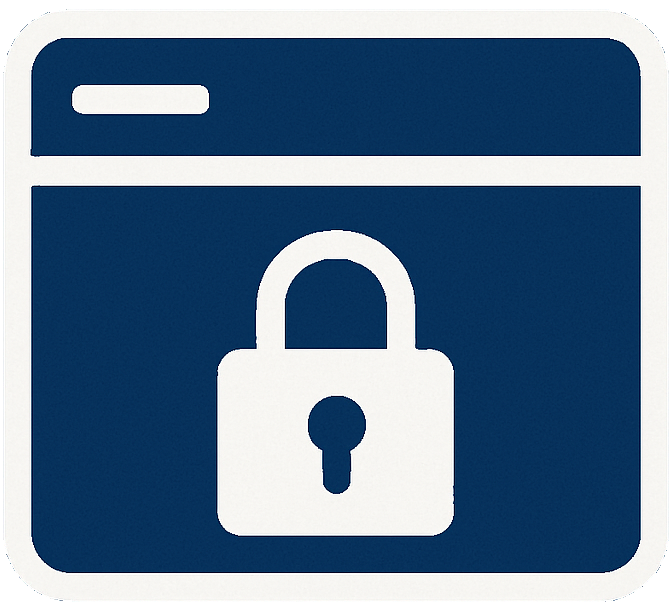

# TabVault - Browser Tab Management Extension

A powerful Chrome extension for saving, organizing, and managing browser tabs with categories, sessions, and quick access features.



## Features

### Tab Organization
- **Save individual tabs** or groups of tabs
- **Create custom categories** for better organization
- **Save tab groups as sessions** for later use
- **Add personal notes** to any saved link

### Quick Access
- **Starred sessions** for instant access
- **Slide-out sidebar** available on any webpage
- **One-click session launch** - open all tabs at once
- **Always accessible** from any website

### Dashboard Management
- **Beautiful, customizable dashboard** interface
- **Drag-and-drop panel layout** for personalized organization
- **Dark mode support** for comfortable viewing
- **Powerful search** across all saved content
- **Responsive design** that works on any screen size

### Privacy & Security
- **100% local storage** - your data never leaves your device
- **No external servers** or data collection
- **Complete control** over your information
- **Secure by design** - follows Chrome's security policies

## Installation

### From Chrome Web Store (Recommended)
1. Visit the [Chrome Web Store](link-to-be-added)
2. Click "Add to Chrome"
3. Confirm the installation
4. Start using TabVault!

### Manual Installation (Developer Mode)
1. Download or clone this repository
2. Open Chrome and go to `chrome://extensions/`
3. Enable "Developer mode" (toggle in top right)
4. Click "Load unpacked" and select the extension folder
5. TabVault will appear in your extensions list

## How to Use

### Quick Start
1. **Save Current Tab:** Click the TabVault extension icon and use "Save Tab"
2. **Add Links Manually:** Use the "Add Link Manually" panel in the dashboard
3. **Create Categories:** Organize your links with custom categories
4. **Save Sessions:** Group related tabs together as sessions
5. **Star Sessions:** Click the ⭐ button to add sessions to quick access

### Dashboard Features
- **Search & Results:** Find your saved links, categories, and sessions instantly
- **Add Link Manually:** Save individual links with custom titles, notes, and categories
- **Saved Sessions:** View and manage your saved tab sessions
- **Saved Categories:** Organize and manage your link categories
- **Saved Links:** Browse all your saved links and create new sessions
- **Create New:** Quickly create new categories and sessions

### Sidebar Quick Access
- **Toggle Sidebar:** Click the blue tab on the left edge of any webpage
- **Launch Sessions:** Click any starred session to open all its tabs
- **Manage Sessions:** Access the dashboard directly from the sidebar

### Customization
- **Dark Mode:** Toggle dark/light theme with the moon icon
- **Panel Layout:** Drag panels to move them, resize corners to adjust size
- **Reset Layout:** Use the gear icon (⚙️) to reset panel positions

## Use Cases

### For Researchers
- Save research tabs by topic or project
- Create sessions for different research phases
- Never lose important sources

### For Developers
- Organize documentation tabs by technology
- Save debugging sessions for later reference
- Quick access to development resources

### For Students
- Organize study materials by subject
- Save lecture-related tabs as sessions
- Access study resources from any webpage

### For Professionals
- Manage work-related tabs by project
- Save client research sessions
- Quick access to frequently used resources

## Technical Details

### Requirements
- Google Chrome browser (version 88 or higher)
- Chrome Web Store account (for installation)

### Permissions
- **tabs:** To access and save tab information
- **storage:** To save your data locally
- **activeTab:** To interact with current tab
- **scripting:** To inject sidebar functionality
- **host_permissions:** To work on all websites

### Data Storage
- All data is stored locally using Chrome's storage API
- No external servers or cloud storage
- Data persists between browser sessions
- Export/import functionality available

## Development

### Project Structure
```
TabVault/
├── manifest.json          # Extension configuration
├── popup.html/js/css      # Extension popup interface
├── dashboard.html/js      # Main dashboard interface
├── newtab.html/js         # Custom new tab page
├── background.js          # Background service worker
├── content-script.js      # Sidebar injection script
├── icons/                 # Extension icons
├── styles.css             # Shared styles
└── README.md             # This file
```

### Building from Source
1. Clone the repository
2. Make your changes
3. Load as unpacked extension in Chrome
4. Test thoroughly
5. Package for distribution

## Legal

- **Privacy Policy:** [View Privacy Policy](https://gabriel-alway.github.io/tabvault/privacy-policy.html)
- **Terms of Service:** [View Terms of Service](https://gabriel-alway.github.io/tabvault/terms-of-service.html)

## Contributing

While this is primarily a personal project, suggestions and feedback are welcome! Please feel free to:
- Report bugs or issues
- Suggest new features
- Share your use cases

## Support

For support, questions, or feedback:
- Check the help section in the dashboard (❓ button)
- Review the documentation above
- Contact through the Chrome Web Store listing

## License

This project is licensed under the MIT License - see the LICENSE file for details.

## Acknowledgments

- Built with modern web technologies
- Designed for user privacy and security
- Inspired by the need for better tab management

---

**TabVault** - Organize your browsing, one tab at a time. 